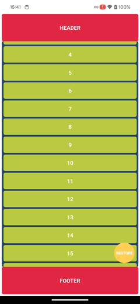

# react-native-fresh-refreshing

Based on [react-native-fresh-refresh](https://github.com/4TWIGGERS/), research some new features.

## Preview

### Pull to next

> support pull to next or pull to previous

### Second floor

> haven't ready yet

## Installation

> haven't ready yet

## Usage

> haven't ready yet

## Contributing

See the [contributing guide](CONTRIBUTING.md) to learn how to contribute to the repository and the development workflow.

## License

MIT

---

Made with [create-react-native-library](https://github.com/callstack/react-native-builder-bob)
